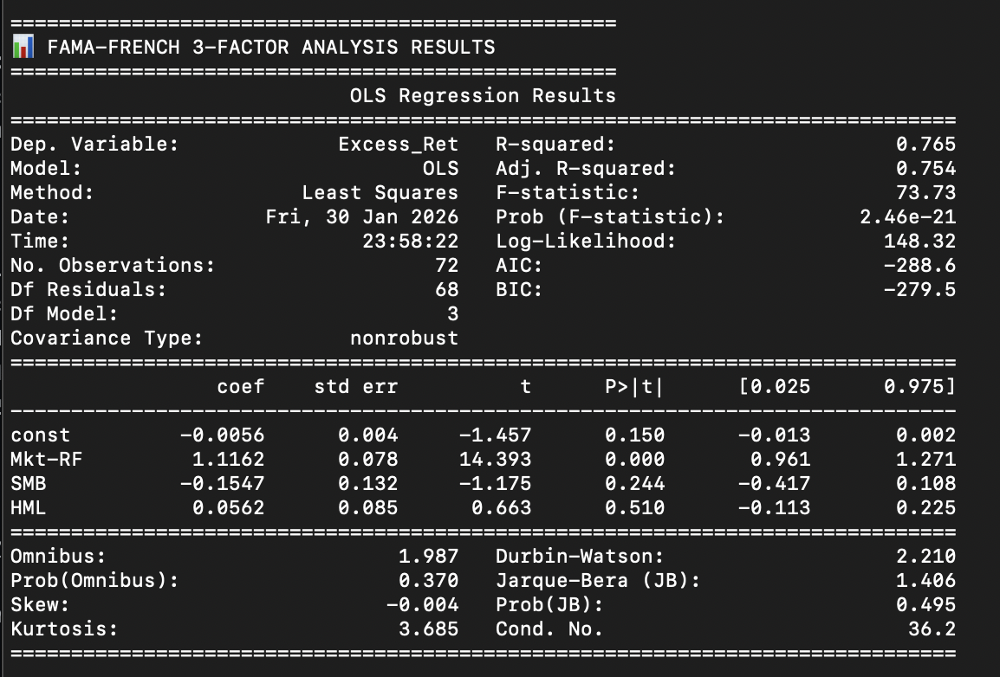

# Interactive AI Stock Predictor & Multi-Factor Model 🚀

This project is a comprehensive **Quantitative Finance** pipeline that combines traditional asset pricing models with modern **Machine Learning** to predict stock performance. It transitions from a statistical evaluation of fundamental factors to a real-time interactive AI forecasting tool.

## 🌟 Key Features
* **Interactive AI Predictor:** A real-time CLI tool where users can input any US ticker (e.g., NVDA, TSLA) to receive immediate AI-driven price direction forecasts.
* **Probabilistic Confidence Scoring:** The model doesn't just predict "Up" or "Down"; it provides a confidence percentage using probability estimation.
* **Fama-French 3-Factor Analysis:** Includes a rigorous statistical engine to decompose portfolio returns into Market, Size, and Value risk premiums.
* **Multi-Factor Ranking:** An automated scoring system that ranks S&P 500 stocks based on Quality (ROE, Debt-to-Equity) and Value (P/E) metrics.

## 🧠 Machine Learning Implementation
The core prediction engine utilizes an **Ensemble Learning** approach:
* **Algorithm:** Random Forest Classifier.
* **Features (Inputs):** Return on Equity (ROE), Forward P/E Ratio, and Debt-to-Equity.
* **Training Data:** Diverse dataset of 40+ major US equities across technology, finance, and energy sectors to ensure model robustness.
* **Target:** Binary classification of forward 1-month price returns (Positive/Negative).

## 📊 Statistical Validation
Before moving to AI, the model's fundamental thesis was validated using the **Fama-French 3-Factor Model**:
* **R-Squared:** 0.765 (Indicating high explanatory power of selected factors).
* **Market Beta:** 1.11 (Statistically significant).
* **Value Loading (HML):** Positive coefficient confirming a successful value-oriented tilt.

### Fama-French Regression Output


 ### AI (Random Forest) Output


## 🛠️ Installation & Usage

1. **Clone the repository:**
   ```bash
   git clone [https://github.com/Noppanat-Chairat/Fundamental-Factor-Model.git](https://github.com/Noppanat-Chairat/Fundamental-Factor-Model.git)

2. **Install dependencies:**
   ```bash
   pip install pandas yfinance scikit-learn statsmodels pandas-datareader

3. **Run the Interactive AI Predictor:**
   ```bash
   python3 src/ml_model.py
   
## Conclusion

* ** By bridging the gap between Fundamental Analysis and Artificial Intelligence, this project demonstrates a modern approach to equity research. The system provides a scalable framework for identifying high-quality assets and predicting short-term market movements based on historical financial patterns.

## 📂 Project Structure
```text
src/analyzer.py: Fama-French OLS regression and factor analysis.

src/ml_model.py: Interactive Machine Learning prediction engine.

src/ranking_model.py: Fundamental scoring and stock selection logic.

data/processed/: Stored financial ratios and ranked stock data.


